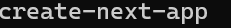
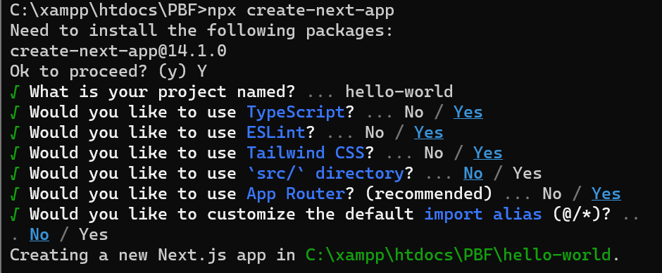
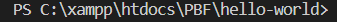
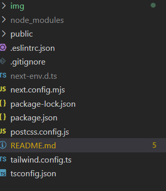

Nama : Iddam Anbiya Haqi

Kelas : TI - 3C

NIM   : 2141720242

Langkah 1 :

Buat Folder Baru
Buatlah folder baru bernama belajar-react lalu di dalam folder tersebut,jalankan terminal dengan mengetikkan perintah berikut

Langkah 2:
Buatlah project bernama hello-world seperti pada gambar berikut ini:

Langkah 3:
Setelah selesai proses langkah sebelumnya,ketik perbaris di terminal seperti berikut untuk masuk ke folder project dan dibuka dengan VS Code.

Maka VS Code akan membuka project react yang dibuat bernama hello-world 

perhatikan struktur file dan folder project react yang telah kita buat ini. Terlihat bahwa inisial Git dalam project ini termasuk, sehingga cukup membuat repository di akun github lalu mengonekkan dengan project 

